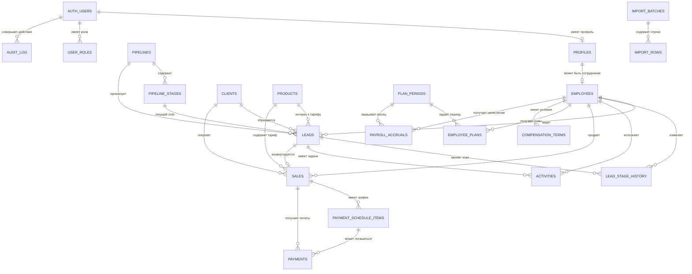

# Схема базы данных DealBuddy CRM

## Выбор СУБД

Для проекта подходит **PostgreSQL в Supabase**. Этот стек уже используется приложением и даёт:

- транзакции и строгие внешние ключи для сделок и оплат;
- Supabase Auth для пользователей;
- Row Level Security (RLS) для разделения прав руководителя и менеджеров;
- представления и агрегаты для дашбордов;
- миграции SQL, которые можно хранить вместе с кодом.

Все суммы хранятся как `numeric(14,2)`, даты событий — как `timestamptz`, месячные периоды — как первое число месяца в поле `date`. Время в базе хранится в UTC, интерфейс показывает его в часовом поясе пользователя.

## Что есть сейчас

Текущий MVP уже содержит таблицы `user_roles`, `employees`, `leads`, `payments`, `plans` и `employee_terms`. Они позволяют запустить существующие экраны, но в них:

- имя и контакт клиента повторяются в лидах и оплатах;
- одна строка `payments` одновременно означает продажу, ожидаемую сумму и поступление денег;
- статус лида хранится произвольной строкой;
- следующее действие хранится текстом и не может нормально участвовать в календаре задач;
- расчёт премии выполняется только на лету и не фиксирует утверждённый результат месяца;
- отсутствует история перемещения сделки по воронке и аудит изменений.

Ниже описана целевая нормализованная схема. Её следует внедрять последовательными миграциями, сохраняя совместимость с текущими экранами.

## ER-диаграмма

## Таблицы

### Доступ и сотрудники

#### `profiles`

Профиль пользователя Supabase Auth.

| Поле                       | Тип           | Правило                           |
| -------------------------- | ------------- | --------------------------------- |
| `user_id`                  | `uuid`        | PK, FK → `auth.users.id`          |
| `full_name`                | `text`        | NOT NULL                          |
| `timezone`                 | `text`        | NOT NULL, default `Europe/Moscow` |
| `is_active`                | `boolean`     | NOT NULL, default `true`          |
| `created_at`, `updated_at` | `timestamptz` | NOT NULL                          |

#### `user_roles`

Роли остаются отдельными от профиля: пользователь может совмещать несколько ролей.

| Поле      | Тип        | Правило                  |
| --------- | ---------- | ------------------------ |
| `user_id` | `uuid`     | FK → `auth.users.id`     |
| `role`    | `app_role` | `admin`, `sales_manager` |

Первичный ключ: `(user_id, role)`.

#### `employees`

Карточка сотрудника. Финансовые условия здесь не хранятся, потому что они меняются во времени.

| Поле                       | Тип           | Правило                                   |
| -------------------------- | ------------- | ----------------------------------------- |
| `id`                       | `uuid`        | PK                                        |
| `user_id`                  | `uuid`        | UNIQUE, nullable, FK → `profiles.user_id` |
| `full_name`                | `text`        | NOT NULL                                  |
| `email`                    | `citext`      | nullable                                  |
| `position_title`           | `text`        | NOT NULL                                  |
| `hired_at`, `dismissed_at` | `date`        | nullable                                  |
| `is_active`                | `boolean`     | NOT NULL                                  |
| `created_at`, `updated_at` | `timestamptz` | NOT NULL                                  |

### CRM и воронка

#### `clients`

Единая карточка клиента, устраняющая дублирование имени и контактов.

| Поле                       | Тип           | Правило                |
| -------------------------- | ------------- | ---------------------- |
| `id`                       | `uuid`        | PK                     |
| `full_name`                | `text`        | NOT NULL               |
| `phone_normalized`         | `text`        | nullable, формат E.164 |
| `telegram_username`        | `citext`      | nullable, без `@`      |
| `email`                    | `citext`      | nullable               |
| `income_range`             | `text`        | nullable               |
| `created_at`, `updated_at` | `timestamptz` | NOT NULL               |

Частичные уникальные индексы создаются отдельно для непустых `phone_normalized`, `telegram_username` и `email`. При импорте неоднозначные совпадения отправляются на ручную проверку, а не объединяются автоматически.

#### `pipelines` и `pipeline_stages`

Справочники воронок и колонок Kanban. Этапы не кодируются строкой в `leads`, поэтому их можно переименовывать и переставлять.

`pipelines`: `id`, `name`, `is_default`, `is_active`, timestamps.

`pipeline_stages`: `id`, `pipeline_id`, `code`, `name`, `position`, `stage_kind`, `color`, `is_active`.

`stage_kind`: `open`, `won`, `lost`. Уникальные ограничения: `(pipeline_id, code)` и `(pipeline_id, position)`.

Стартовые этапы: `new`, `in_work`, `offer_sent`, `won`, `lost`.

#### `products`

Справочник тарифов вместо свободного текста: `id`, `code`, `name`, `list_price`, `is_active`, timestamps. На момент продажи цена дополнительно фиксируется в `sales`, чтобы изменение прайса не меняло историю.

#### `leads`

Заявка/сделка в воронке.

| Поле                       | Тип             | Правило                                   |
| -------------------------- | --------------- | ----------------------------------------- |
| `id`                       | `uuid`          | PK                                        |
| `client_id`                | `uuid`          | NOT NULL, FK → `clients.id`               |
| `manager_id`               | `uuid`          | FK → `employees.id`, `ON DELETE SET NULL` |
| `pipeline_id`              | `uuid`          | NOT NULL, FK → `pipelines.id`             |
| `stage_id`                 | `uuid`          | NOT NULL, FK → `pipeline_stages.id`       |
| `product_id`               | `uuid`          | nullable, FK → `products.id`              |
| `request_text`             | `text`          | запрос клиента                            |
| `source`                   | `text`          | источник заявки                           |
| `expected_amount`          | `numeric(14,2)` | CHECK ≥ 0                                 |
| `position`                 | `integer`       | порядок в Kanban                          |
| `received_at`              | `timestamptz`   | дата заявки                               |
| `closed_at`                | `timestamptz`   | только для won/lost                       |
| `loss_reason`              | `text`          | причина отказа                            |
| `created_at`, `updated_at` | `timestamptz`   | NOT NULL                                  |

Проверяется, что `stage_id` относится к указанному `pipeline_id`. Основные индексы: `(manager_id, stage_id, position)`, `(received_at)`, `(client_id)`.

#### `lead_stage_history`

Неизменяемая история движения: `id`, `lead_id`, `from_stage_id`, `to_stage_id`, `changed_by`, `changed_at`, `comment`. Запись создаётся в той же транзакции, что и смена этапа.

#### `activities`

Звонки, сообщения, встречи и задачи вместо одного текстового `next_action`.

| Поле                                                 | Тип                                          |
| ---------------------------------------------------- | -------------------------------------------- |
| `id`, `lead_id`, `assignee_id`, `created_by`         | `uuid`                                       |
| `kind`                                               | `call`, `message`, `meeting`, `task`, `note` |
| `subject`, `description`                             | `text`                                       |
| `due_at`, `completed_at`, `created_at`, `updated_at` | `timestamptz`                                |
| `status`                                             | `pending`, `completed`, `cancelled`          |

Индекс `(assignee_id, status, due_at)` обеспечивает экран задач на сегодня.

### Продажи и деньги

#### `sales`

Коммерческий результат выигранной сделки. На один лид допускается не более одной продажи.

| Поле                                    | Тип                                   | Правило                                  |
| --------------------------------------- | ------------------------------------- | ---------------------------------------- |
| `id`                                    | `uuid`                                | PK                                       |
| `order_no`                              | `bigint generated always as identity` | UNIQUE                                   |
| `lead_id`                               | `uuid`                                | UNIQUE, FK → `leads.id`                  |
| `client_id`, `manager_id`, `product_id` | `uuid`                                | NOT NULL, FK                             |
| `product_name_snapshot`                 | `text`                                | NOT NULL                                 |
| `gross_amount`                          | `numeric(14,2)`                       | CHECK ≥ 0                                |
| `expected_net_amount`                   | `numeric(14,2)`                       | CHECK ≥ 0                                |
| `payment_method`                        | `text`                                | `full`, `installment`, `external_credit` |
| `sold_at`                               | `timestamptz`                         | NOT NULL                                 |
| `created_at`, `updated_at`              | `timestamptz`                         | NOT NULL                                 |

Перевод лида в `won`, создание продажи и начального графика выполняет одна транзакционная RPC-функция `close_lead_as_won(...)`. Это исключает ситуацию, когда этап изменился, а продажа не создалась.

#### `payment_schedule_items`

Плановые взносы: `id`, `sale_id`, `sequence_no`, `due_date`, `expected_amount`, `status`, timestamps. Уникальность `(sale_id, sequence_no)`. Статусы: `planned`, `partially_paid`, `paid`, `overdue`, `cancelled`.

#### `payments`

Только фактически полученные деньги, а не вся продажа целиком.

| Поле                                        | Тип             | Правило                                    |
| ------------------------------------------- | --------------- | ------------------------------------------ |
| `id`                                        | `uuid`          | PK                                         |
| `sale_id`                                   | `uuid`          | NOT NULL, FK → `sales.id`                  |
| `schedule_item_id`                          | `uuid`          | nullable, FK → `payment_schedule_items.id` |
| `gross_amount`                              | `numeric(14,2)` | CHECK > 0                                  |
| `net_amount`                                | `numeric(14,2)` | CHECK ≥ 0 и ≤ gross                        |
| `paid_at`                                   | `timestamptz`   | NOT NULL                                   |
| `provider`, `external_reference`, `comment` | `text`          | nullable                                   |
| `created_by`                                | `uuid`          | FK → `auth.users.id`                       |
| `created_at`                                | `timestamptz`   | NOT NULL                                   |

Индексы: `(sale_id, paid_at)` и `(paid_at)`. Дебиторка вычисляется как сумма продажи минус сумма платежей, а не редактируется вручную.

### Планы и зарплата

#### `plan_periods`

Командный план месяца: `id`, `period`, `plan_min`, `plan_target`, `plan_max`, `status`, timestamps. `period` уникален и всегда равен первому числу месяца; `0 ≤ min ≤ target ≤ max`. Статусы: `draft`, `active`, `closed`.

#### `employee_plans`

План сотрудника: `id`, `plan_period_id`, `employee_id`, `plan_min`, `plan_target`, `plan_max`, timestamps. Уникальность `(plan_period_id, employee_id)` и те же проверки границ.

#### `compensation_terms`

История условий оплаты: `id`, `employee_id`, `valid_from`, `valid_to`, `salary`, `base_rate`, `min_coef`, `target_coef`, timestamps. Диапазоны действия одного сотрудника не должны пересекаться; все денежные значения и коэффициенты неотрицательны.

#### `payroll_accruals`

Утверждённый снимок расчёта за месяц: `id`, `plan_period_id`, `employee_id`, `fact_net_amount`, `salary_amount`, `base_rate`, `applied_coef`, `bonus_amount`, `total_amount`, `calculated_at`, `approved_by`, `approved_at`, `status`. Уникальность `(plan_period_id, employee_id)`.

До утверждения интерфейс показывает расчёт из платежей. После утверждения отчёты используют снимок, поэтому последующее изменение условий не переписывает закрытый месяц.

### Импорт и аудит

#### `import_batches` и `import_rows`

`import_batches` хранит источник, имя файла, контрольную сумму, автора, время и итог импорта. `import_rows` хранит номер листа/строки, исходный JSON, результат, найденные ошибки и ссылку на созданную сущность. Это позволяет повторно импортировать Excel без дублей и разбирать проблемные строки.

#### `audit_log`

Неизменяемый журнал критичных операций: `actor_user_id`, `entity_type`, `entity_id`, `action`, `before_data`, `after_data`, `created_at`. В него попадают смена менеджера/этапа, изменения оплат, планов, условий и утверждение зарплаты.

## Представления для интерфейса

- `v_lead_board` — карточки Kanban с клиентом, менеджером, тарифом и ближайшей задачей.
- `v_sales_balances` — продажа, оплачено, дебиторка и следующий платёж.
- `v_monthly_manager_performance` — чистые поступления, план и процент выполнения по менеджерам.
- `v_payroll_preview` — предварительная премия и сумма к выплате.
- `v_dashboard_monthly` — общий факт, планы min/target/max, конверсия и динамика поступлений.

Представления не обходят RLS: менеджер получает только собственные строки, руководитель — все.

## Модель доступа (RLS)

| Данные                               | Менеджер               | Руководитель (`admin`)                 |
| ------------------------------------ | ---------------------- | -------------------------------------- |
| Собственный профиль и условия        | чтение                 | чтение всех, изменение                 |
| Лиды и задачи                        | только назначенные ему | все, включая переназначение и удаление |
| Продажи и оплаты                     | только свои            | все, создание/исправление/удаление     |
| Личный план и предварительная премия | чтение                 | все, управление и утверждение          |
| Общий дашборд и аудит                | нет                    | чтение                                 |
| Справочники                          | чтение                 | управление                             |

Все операции администрирования пользователей выполняются серверным кодом с `service_role`; этот ключ никогда не передаётся браузеру.

## Переход от текущей схемы

1. Добавить справочники, `clients`, `sales`, график платежей и историю этапов.
2. Перенести уникальных клиентов из `leads` и `payments`, сохранив исходные строки в `import_rows`.
3. Связать лиды с клиентами и заменить текстовые статусы на `stage_id`.
4. Разделить текущие строки `payments` на продажи, плановые взносы и фактические платежи.
5. Перенести `plans` в командные и персональные планы; преобразовать `employee_terms` в непересекающиеся периоды действия.
6. Добавить снимки начислений, аудит и отчётные представления.
7. После переключения интерфейса удалить устаревшие дублирующие поля отдельной миграцией.

Миграции должны быть только добавочными и последовательными, без переписывания опубликованной истории Git.
