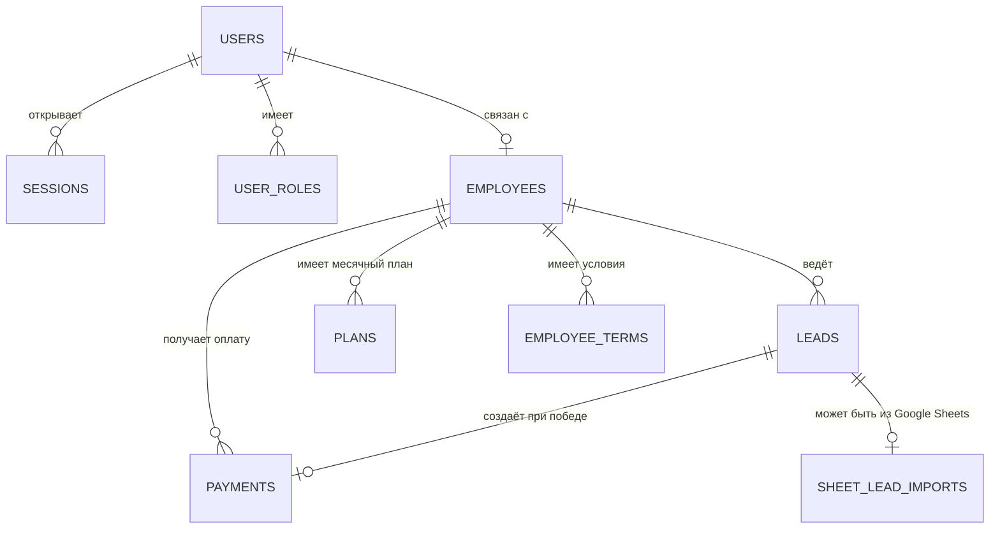

# SQLite-схема Pulse CRM

## Назначение

Проект использует локальную реляционную базу **SQLite**. Она хранится в `data/pulse-crm.sqlite` и открывается только серверной частью TanStack Start через встроенный модуль Node.js `node:sqlite`. Браузер не получает прямого доступа к файлу и выполняет операции через проверяемые server functions.

Схема спроектирована под текущие функции CRM:

- авторизация руководителя и менеджеров;
- Kanban заявок;
- автоматическое создание оплаты из выигранной заявки;
- таблица оплат и дебиторки;
- командные и персональные планы по месяцам;
- история оклада, ставки и коэффициентов;
- расчёт премий и рабочего стола менеджера;
- добавление и отключение сотрудников.

Исполняемая SQL-схема находится в `database/schema.sql`.

## ER-диаграмма

## Таблицы

### `users`

Локальные учётные записи.

| Поле            | Тип       | Ограничение                          |
| --------------- | --------- | ------------------------------------ |
| `id`            | `TEXT`    | PK, UUID                             |
| `email`         | `TEXT`    | UNIQUE, NOT NULL, без учёта регистра |
| `password_hash` | `TEXT`    | результат `scrypt`                   |
| `password_salt` | `TEXT`    | индивидуальная случайная соль        |
| `is_active`     | `INTEGER` | `0` или `1`                          |
| `created_at`    | `TEXT`    | ISO 8601, UTC                        |

Пароли в открытом виде не сохраняются. Тестовые пароли используются только при первоначальном создании базы.

### `sessions`

| Поле         | Тип    | Ограничение              |
| ------------ | ------ | ------------------------ |
| `token_hash` | `TEXT` | PK, SHA-256 от токена    |
| `user_id`    | `TEXT` | FK → `users.id`, CASCADE |
| `expires_at` | `TEXT` | срок действия 30 дней    |
| `created_at` | `TEXT` | ISO 8601, UTC            |

В браузере хранится случайный токен, в базе — только его хеш. При выходе сессия удаляется.

### `user_roles`

| Поле         | Тип    | Ограничение              |
| ------------ | ------ | ------------------------ |
| `id`         | `TEXT` | PK                       |
| `user_id`    | `TEXT` | FK → `users.id`, CASCADE |
| `role`       | `TEXT` | `admin` или `manager`    |
| `created_at` | `TEXT` | ISO 8601                 |

Уникальность `(user_id, role)` позволяет безопасно расширять модель ролей.

### `employees`

Карточки сотрудников и текущие условия оплаты.

| Поле                                   | Тип       | Назначение                                  |
| -------------------------------------- | --------- | ------------------------------------------- |
| `id`, `user_id`                        | `TEXT`    | PK и необязательная связь с учётной записью |
| `full_name`, `email`, `position_title` | `TEXT`    | данные сотрудника                           |
| `salary`                               | `REAL`    | текущий оклад                               |
| `base_rate`                            | `REAL`    | базовый процент премии                      |
| `min_coef`, `target_coef`              | `REAL`    | повышающие коэффициенты                     |
| `is_active`                            | `INTEGER` | активность сотрудника                       |
| `created_at`, `updated_at`             | `TEXT`    | аудит времени                               |

Текущие значения нужны для нового месяца; исторические значения хранятся в `employee_terms`.

### `leads`

Заявки и карточки Kanban.

| Группа        | Поля                                                               |
| ------------- | ------------------------------------------------------------------ |
| Идентификация | `id`, `lead_date`, `client_name`                                   |
| Контакты      | `phone`, `telegram`                                                |
| Потребность   | `income`, `request`, `comment`, `next_action`                      |
| Воронка       | `status`, `source_status`, `position`, `manager_id`                |
| Предложение   | `tariff`, `amount`, `net_amount`, `payment_method`, `payment_date` |
| Аудит         | `created_at`, `updated_at`                                         |

`status` ограничен значениями `new`, `in_work`, `offer_sent`, `won`, `lost`. Индекс `(manager_id, status, position)` ускоряет построение доски.

Поле `origin` (`manual` по умолчанию, либо `google_sheets`) показывает источник заявки: создана вручную менеджером/руководителем в интерфейсе или подтянута автоматической синхронизацией с Google-таблицей. Через общий API (`db.from("leads")` на клиенте) поле доступно только на чтение — выставить `google_sheets` может исключительно серверный модуль синхронизации.

### `sheet_lead_imports`

Журнал уже импортированных строк Google-таблицы, чтобы повторный опрос не создавал дубликаты заявок.

| Поле          | Тип    | Назначение                                |
| ------------- | ------ | ----------------------------------------- |
| `row_hash`    | `TEXT` | PK, SHA-256 от содержимого строки таблицы |
| `lead_id`     | `TEXT` | FK → `leads.id`, CASCADE                  |
| `imported_at` | `TEXT` | ISO 8601, UTC                             |

### `payments`

Оплаты и дебиторская задолженность.

| Поле                                  | Тип               | Назначение                        |
| ------------------------------------- | ----------------- | --------------------------------- |
| `id`, `order_no`                      | `TEXT`, `INTEGER` | идентификаторы                    |
| `client_name`, `contact`, `tariff`    | `TEXT`            | снимок данных продажи             |
| `revenue`, `net_profit`, `receivable` | `REAL`            | выручка, чистая прибыль и остаток |
| `payment_method`, `payment_date`      | `TEXT`            | способ и дата оплаты              |
| `manager_id`                          | `TEXT`            | FK → `employees.id`               |
| `lead_id`                             | `TEXT`            | UNIQUE FK → `leads.id`            |
| `schedule_note`                       | `TEXT`            | график/комментарий по рассрочке   |
| `created_at`                          | `TEXT`            | ISO 8601                          |

Уникальный `lead_id` не позволяет создать две автоматические оплаты для одной заявки.

### `plans`

Месячные планы.

| Поле          | Тип    | Назначение                            |
| ------------- | ------ | ------------------------------------- |
| `id`          | `TEXT` | PK                                    |
| `period`      | `TEXT` | первое число месяца `YYYY-MM-01`      |
| `employee_id` | `TEXT` | сотрудник или `NULL` для общего плана |
| `plan_min`    | `REAL` | план-минимум                          |
| `plan_target` | `REAL` | целевой план                          |
| `plan_max`    | `REAL` | максимум                              |

Проверяется `0 ≤ plan_min ≤ plan_target ≤ plan_max`. Частичные уникальные индексы разрешают один общий и один персональный план на месяц.

### `employee_terms`

История условий сотрудника по месяцам: `employee_id`, `period`, `salary`, `base_rate`, `min_coef`, `target_coef`. Уникальность `(employee_id, period)` гарантирует одну версию условий на сотрудника за месяц.

## Импорт заявок из Google Sheets

Заявки могут поступать не только вручную, но и из внешней Google-таблицы (например, ответов Google-формы) со столбцами: «Отметка времени», «Выберите продукт», «Как к вам обращаться», «Ваш номер телефона для связи», «Ваш никнейм в Telegram», «Запрос».

- Модуль `src/lib/google-sheets.server.ts` читает опубликованный Google Sheets CSV по зафиксированному серверному URL.
- Каждая строка хешируется и записывается в `sheet_lead_imports`, поэтому повторный опрос не создаёт дублей.
- Новая заявка создаётся со `status = 'new'`, `origin = 'google_sheets'`, без `manager_id` — руководитель распределяет её вручную из колонки «Новая заявка».
- Тариф берётся из столбца «Выберите продукт» как есть; ожидаемые значения: «Обучение с куратором», «Самостоятельное обучение», «Обучение с VIP-сопровождением от автора курса», «Часовая консультация» (тот же список используется для ручного ввода в интерфейсе).
- Синхронизация запускается двумя способами: кнопкой «Обновить из Google Sheets» на странице «Заявки» (только для руководителя) и фоново — раз в `GOOGLE_SHEETS_SYNC_INTERVAL_MINUTES` минут, пока запущен сервер.

## Права доступа

SQLite не имеет встроенного RLS. Его эквивалент реализован в `src/lib/sqlite.server.ts` и применяется до выполнения каждого запроса.

| Данные           | Руководитель        | Менеджер                                |
| ---------------- | ------------------- | --------------------------------------- |
| Сотрудники       | все, редактирование | только своя карточка                    |
| Заявки           | все                 | только `manager_id` текущего сотрудника |
| Оплаты           | все                 | только собственные                      |
| Планы            | все, редактирование | свой и общий план, только чтение        |
| Условия и премии | все, редактирование | только собственные, чтение              |
| Учётные записи   | создание            | нет доступа                             |

Имена таблиц, столбцов и операций проверяются по серверному allowlist. Из браузера нельзя отправить произвольный SQL.

## Целостность и производительность

- Включены `foreign_keys`, режим журнала `WAL` и ожидание блокировки до 5 секунд.
- Денежные значения не могут быть отрицательными.
- Персональные планы и условия уникальны в рамках месяца.
- Каскадное удаление используется только для зависимостей учётной записи и истории условий.
- Основные фильтры Kanban, оплат, периодов и сессий покрыты индексами.
- Триггеры автоматически обновляют `updated_at` у заявок и сотрудников.

## Файл, запуск и резервные копии

- Основной файл: `data/pulse-crm.sqlite`.
- Возможные служебные файлы: `pulse-crm.sqlite-wal` и `pulse-crm.sqlite-shm`.
- Все они исключены из Git через `.gitignore`.
- Первичное создание: `npm run db:init`.
- Альтернативный путь: `SQLITE_DB_PATH` в `.env`.

Для резервной копии при остановленном приложении достаточно скопировать файл базы. При работающем приложении следует использовать SQLite backup API либо копировать основной файл вместе с `-wal` и `-shm`.

## Ограничения выбранного решения

SQLite подходит для локальной работы и небольшой команды на одном сервере. Если несколько экземпляров приложения должны одновременно писать в общую базу или требуется горизонтальное масштабирование, следует перейти на серверную PostgreSQL, сохранив текущую предметную модель.
